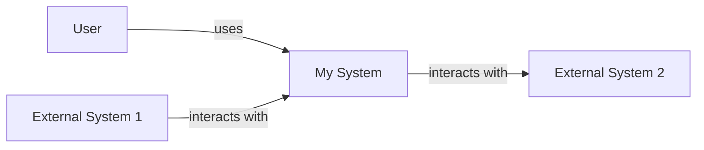
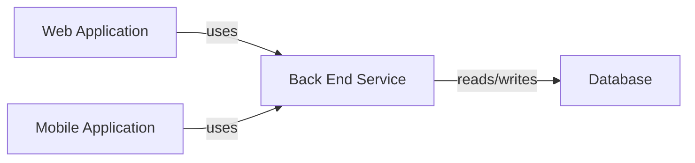
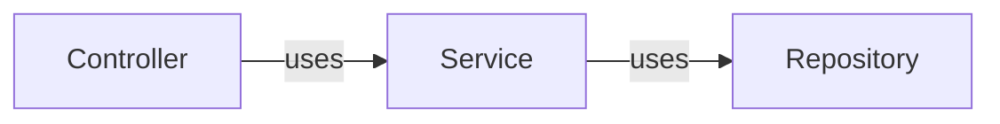
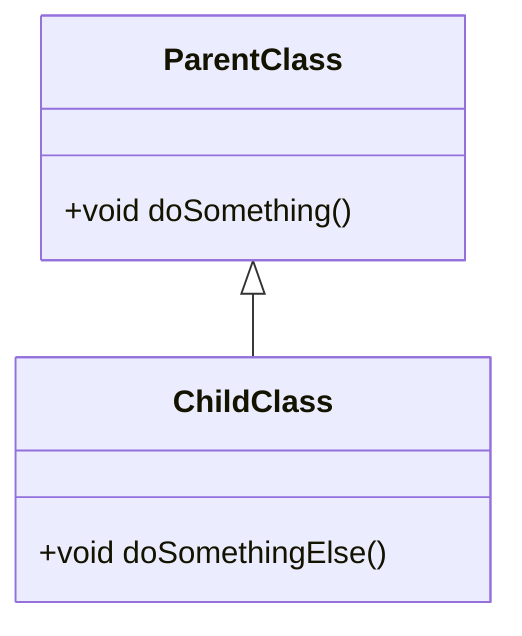



C4模型是一種用於視覺化和描述軟件架構的方法，它提供了一套標準化的語言來描繪系統的各個層面。這個模型由四個不同的視圖組成，每個視圖專注於不同層面的詳細程度，從高級別的系統概覽到低級別的組件細節。以下是C4模型的四個主要視圖：

1.  **系統視圖 (System Context)**：這是最頂層的視圖，用於展示系統如何與其外部環境（如使用者、其他系統等）交互。它提供了系統的大致框架，並顯示了系統的邊界以及與外部系統或用戶的關係。

2.  **容器視圖 (Container)**：這個視圖提供了系統的內部結構，但仍然保持在較高的一般性水平。它展示了系統中的主要應用程序或服務，以及這些應用程序或服務之間的交互方式。

3.  **組件視圖 (Component)**：當進入到更具體的層面時，組件視圖展示了每個主要應用程序或服務的內部結構。它包括了系統中的各個組件（如模塊、類別等），並顯示了這些組件之間的依賴關係。

4.  **碼視圖 (Code)**：這是C4模型中最詳細的視圖，專注於特定的技術實現細節。它展示了系統中的具體代碼結構，如類別定義、函數、變量等。這個視圖對於開發人員來說非常有用，因為它提供了直接的編程相關信息。

C4模型的目的是通過提供一種統一的視覺化工具來幫助團隊更好地理解和交流軟件架構。無論是在初期的規劃階段還是在後期的維護階段，這種方法都能夠有效地促進溝通和協作。
