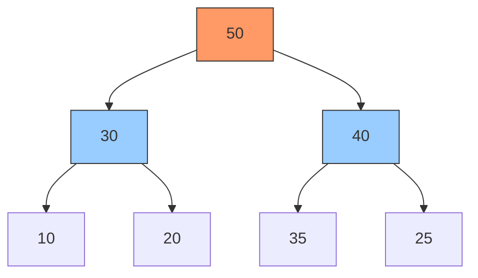
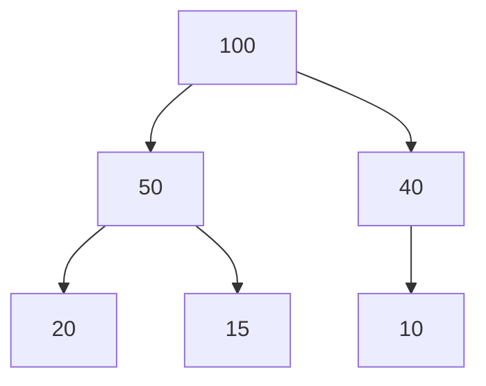
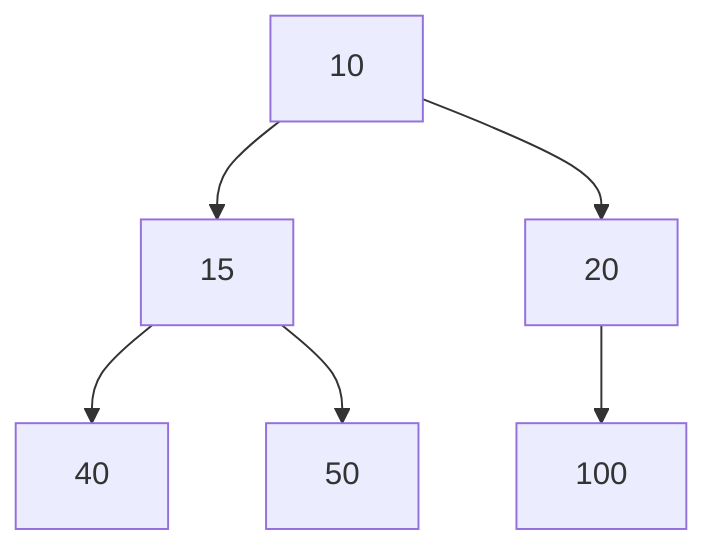

# 用Java學資料結構-堆Heap



## 什麼是堆 (Heap)

### 堆的基本概念

#### 堆的定義

- 堆的特性（最大堆與最小堆）        
    - 最大堆：每個節點的值都大於或等於其子節點的值
    ```mermaid
    graph TD
        subgraph 最大堆
        A[100]-->B[80]
        A-->C[90]
        B-->D[70]
        B-->E[75]
        end
    ```    
    - 最小堆：每個節點的值都小於或等於其子節點的值
    ```mermaid
    graph TD
        subgraph 最小堆
        A[10]-->B[20]
        A-->C[15]
        B-->D[40]
        B-->E[30]
        end
    ```    
- 完全二元樹的結構
    - 除了最底層，其他層的節點都必須是滿的
    ```mermaid
    graph TD
        A[50]-->B[30]
        A-->C[40]
        B-->D[10]
        B-->E[20]
    ```
    - 最底層的節點從左到右填入，不能有空隙，像底下這樣就是一個不合法的完全二元樹，在最底層沒有從左到右填入，且出現了空隙(指沒有子節點的地方)
    ```mermaid
    graph TD
        A[50]-->B[30]
        A-->C[40]
        B-->E[10]
        C-->F[20]
    ```

## 堆的應用場景

### 堆的優勢

- 堆的插入與刪除操作的時間複雜度都是 O(logN)
> O(logN)：隨著元素數量 N 的增加，時間複雜度增加的速度是對數級別的，也就是說當 N 翻倍時，時間複雜度只增加一個常數倍數，例如 N=2 時，時間複雜度是 1，N=4 時，時間複雜度是 2，N=8 時，時間複雜度是 3，以此類推
- 堆可以快速找到最大值或最小值

#### 堆的常見使用情境

- 任務調度有順序且有優先分級需求時，可以使用堆來實現優先佇列
- 資料流中找出前 K 大或前 K 小的元素
- 合併多個有序陣列

### 堆的限制

- 當需要頻繁地查找中間元素時，時間複雜度是 O(N)
> O(N)：隨著元素數量 N 的增加，時間複雜度增加的速度是線性的，也就是說當 N 翻倍時，時間複雜度也會翻倍，例如 N=2 時，時間複雜度是 2，N=4 時，時間複雜度是 4，N=8 時，時間複雜度是 8，以此類推
- 佔用的記憶體空間較大

#### 不適合使用堆的情況

- 當需要頻繁地查找中間元素時
- 需要快速查找元素的索引時
- 需要有序遍歷所有元素時
- 資料量較小時

## 使用 Java 實現堆

我們來使用 Java 來實作堆，首先我們需要定義堆的基本操作
- 獲取父節點的索引
- 獲取左子節點的索引
- 獲取右子節點的索引
- 交換左右子節點的值
- 上浮操作，上浮指的是將某個節點的值與其父節點的值進行比較，如果不符合堆的特性(最大堆或最小堆)，則交換兩者的值，直到滿足堆的特性
- 下沉操作，下沉指的是將某個節點的值與其子節點的值進行比較，如果不符合堆的特性(最大堆或最小堆)，則交換兩者的值，直到滿足堆的特性
- 插入元素
- 刪除堆頂並返回新的堆頂元素
- 查看堆頂元素
- 獲取堆的大小
- 判斷堆是否為空

```java
public class Heap {
    private int[] elements;
    private int size;
    private boolean isMaxHeap;
    
    // 結構子
    public Heap(int capacity, boolean isMax) {
        elements = new int[capacity];
        size = 0;
        isMaxHeap = isMax;
    }
    
    // 獲取父節點索引
    private int parent(int index) {
        return (index - 1) / 2;
    }
    
    // 獲取左子節點索引
    private int leftChild(int index) {
        return 2 * index + 1;
    }
    
    // 獲取右子節點索引
    private int rightChild(int index) {
        return 2 * index + 2;
    }
    
    // 交換左右子節點的值
    private void swap(int i, int j) {
        int temp = elements[i];
        elements[i] = elements[j];
        elements[j] = temp;
    }
    
    // 上浮操作
    private void heapifyUp(int index) {
        while (index > 0) {
            int parent = parent(index);
            if (isMaxHeap) {
                if (elements[index] > elements[parent]) {
                    swap(index, parent);
                    index = parent;
                } else {
                    break;
                }
            } else {
                if (elements[index] < elements[parent]) {
                    swap(index, parent);
                    index = parent;
                } else {
                    break;
                }
            }
        }
    }
    
    // 下沉操作
    private void heapifyDown(int index) {
        while (true) {
            int largest = index;
            int left = leftChild(index);
            int right = rightChild(index);
            
            if (isMaxHeap) {
                if (left < size && elements[left] > elements[largest]) {
                    largest = left;
                }
                if (right < size && elements[right] > elements[largest]) {
                    largest = right;
                }
            } else {
                if (left < size && elements[left] < elements[largest]) {
                    largest = left;
                }
                if (right < size && elements[right] < elements[largest]) {
                    largest = right;
                }
            }
            
            if (largest == index) {
                break;
            }
            swap(index, largest);
            index = largest;
        }
    }
    
    // 插入元素
    public void insert(int value) {
        if (size >= elements.length) {
            throw new IllegalStateException("Heap is full");
        }
        elements[size] = value;
        heapifyUp(size);
        size++;
    }
    
    // 刪除堆頂元素並返回新的堆頂元素
    public int poll() {
        if (size == 0) {
            throw new IllegalStateException("Heap is empty");
        }
        int result = elements[0];
        elements[0] = elements[--size];
        if (size > 0) {
            heapifyDown(0);
        }
        return result;
    }
    
    // 查看堆頂元素
    public int peek() {
        if (size == 0) {
            throw new IllegalStateException("Heap is empty");
        }
        return elements[0];
    }
    
    // 獲取堆的大小
    public int size() {
        return size;
    }
    
    // 判斷堆是否為空
    public boolean isEmpty() {
        return size == 0;
    }

        // 自下而上建立堆
    public void buildHeapBottomUp(int[] array) {
        // 複製數組到堆中
        System.arraycopy(array, 0, elements, 0, array.length);
        size = array.length;
        
        // 從最後一個非葉節點開始向下堆化
        for (int i = size/2 - 1; i >= 0; i--) {
            heapifyDown(i);
        }
    }

    // 自上而下建立堆
    public void buildHeapTopDown(int[] array) {
        size = 0;
        // 逐個插入元素
        for (int value : array) {
            insert(value);
        }
    }

    // 堆排序
    public int[] heapSort() {
        int[] result = new int[size];
        int originalSize = size;
        
        for (int i = 0; i < originalSize; i++) {
            result[i] = poll();  // 對於最小堆，將得到升序排序
        }
        
        return result;
    }

    public static int[] findTopK(int[] nums, int k, boolean findMax) {
        Heap heap = new Heap(k, !findMax); // 找最大用最小堆，找最小用最大堆
        
        for (int num : nums) {
            if (heap.size() < k) {
                heap.insert(num);
            } else if ((findMax && num > heap.peek()) || 
                    (!findMax && num < heap.peek())) {
                heap.poll();
                heap.insert(num);
            }
        }
        
        // 取出結果並反轉順序
        int[] result = new int[heap.size()];
        for (int i = result.length - 1; i >= 0; i--) {
            result[i] = heap.poll();
        }
        return result;
    }
}
```
- 接下來我們就來使用這個 Heap 類來實現堆的操作
```java
public class Main {

    public static void main(String[] args) {
        Heap maxHeap1 = new Heap(10, true);
        maxHeap1.insert(10);
        maxHeap1.insert(20);
        maxHeap1.insert(15);
        maxHeap1.insert(40);
        maxHeap1.insert(50);
        maxHeap1.insert(100);

        System.out.println("\n===最大堆===");
        System.out.println(maxHeap1.poll()); // 100
        System.out.println(maxHeap1.poll()); // 50
        System.out.println(maxHeap1.poll()); // 40
        System.out.println(maxHeap1.poll()); // 20
        System.out.println(maxHeap1.poll()); // 15
        System.out.println(maxHeap1.poll()); // 10

        Heap minHeap1 = new Heap(10, false);
        minHeap1.insert(10);
        minHeap1.insert(20);
        minHeap1.insert(15);
        minHeap1.insert(40);
        minHeap1.insert(50);
        minHeap1.insert(100);

        System.out.println("\n===最小堆===");
        System.out.println(minHeap1.poll()); // 10
        System.out.println(minHeap1.poll()); // 15
        System.out.println(minHeap1.poll()); // 20
        System.out.println(minHeap1.poll()); // 40
        System.out.println(minHeap1.poll()); // 50
        System.out.println(minHeap1.poll()); // 100

        int[] array = {4, 10, 3, 5, 1};

        // 1. 測試自下而上建立最大堆
        System.out.println("\n===自下而上建立最大堆===");
        Heap maxHeap2 = new Heap(10, true);
        maxHeap2.buildHeapBottomUp(array);
        System.out.println("堆頂元素: " + maxHeap2.peek());  // 應該輸出 10

        // 2. 測試自上而下建立最小堆
        System.out.println("\n===自上而下建立最小堆===");
        Heap minHeap2 = new Heap(10, false);
        minHeap2.buildHeapTopDown(array);
        System.out.println("堆頂元素: " + minHeap2.peek());  // 應該輸出 1

        // 3. 測試堆排序
        System.out.println("\n===堆排序===");
        int[] sorted = minHeap2.heapSort();
        System.out.print("排序結果: ");
        for (int num : sorted) {
            System.out.print(num + " ");  // 應該輸出 1 3 4 5 10
        }

        // 4. 測試找到資料流中的前 K 大元素
        int[] nums = {4, 10, 3, 5, 1, 8, 7, 9, 2, 6};

        // 測試找出前3大的數
        System.out.println("\n\n===找出前3大的數===");
        int[] topThreeLargest = Heap.findTopK(nums, 3, true);
        System.out.print("前3大的數: ");
        for (int num : topThreeLargest) {
            System.out.print(num + " "); // 預期輸出: 10 9 8
        }

        System.out.println("\n\n===找出前3小的數===");
        int[] topThreeSmallest = Heap.findTopK(nums, 3, false);
        System.out.print("前3小的數: ");
        for (int num : topThreeSmallest) {
            System.out.print(num + " "); // 預期輸出: 1 2 3
        }

        // 測試邊界情況
        System.out.println("\n\n===測試邊界情況===");
        int[] singleNum = {1};
        int[] result1 = Heap.findTopK(singleNum, 1, true);
        System.out.println("單一元素找最大: " + result1[0]); // 預期輸出: 1

        int[] result2 = Heap.findTopK(nums, nums.length, true);
        System.out.print("k等於陣列長度: ");
        for (int num : result2) {
            System.out.print(num + " "); // 預期輸出: 全部元素，由大到小排序
        }

    }


}
```
- 在 maxHeap1 中，我們使用最大堆來實現，插入元素後，堆的結構如下

- 在 minHeap1 中，我們使用最小堆來實現，插入元素後，堆的結構如下


### 針對 Heap 類別中的程式碼進行時間與空間複雜度分析

#### 基本操作複雜度

1. 查詢操作
- peek(): O(1)
- size(): O(1)
- isEmpty(): O(1)

2. 修改操作
- insert(): O(log n)
- poll(): O(log n)
- heapifyUp(): O(log n)
- heapifyDown(): O(log n)

#### 建堆方法複雜度

1. 自下而上建堆 (buildHeapBottomUp)
- 時間複雜度: O(n)
- 空間複雜度: O(n)
原因：
- 只需處理非葉節點
- 從下往上處理，每層節點數減半
- 總操作次數為 n/4 + n/8 + n/16 + ... = n

2. 自上而下建堆 (buildHeapTopDown)
- 時間複雜度: O(n log n)
- 空間複雜度: O(n)
原因：
- 每個元素都需要上浮操作
- n個元素，每個上浮最多log n層


#### 堆排序複雜度

heapSort()
- 時間複雜度: O(n log n)
- 空間複雜度: O(n)
原因：
- 需要額外陣列儲存結果
- 每次取出堆頂元素需要O(log n)
- 總共取出n個元素

#### 空間使用分析

1. 固定空間：
- elements[]: O(n)
- size: O(1)
- isMaxHeap: O(1)

2. 臨時空間：
- swap(): O(1)
- heapSort(): O(n)

### 有機會再來實作其他堆的應用

- 合併 K 個有序陣列
- 實現中位數資料結構

- 堆的最佳實踐與優化
