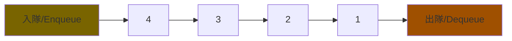
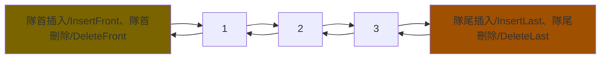
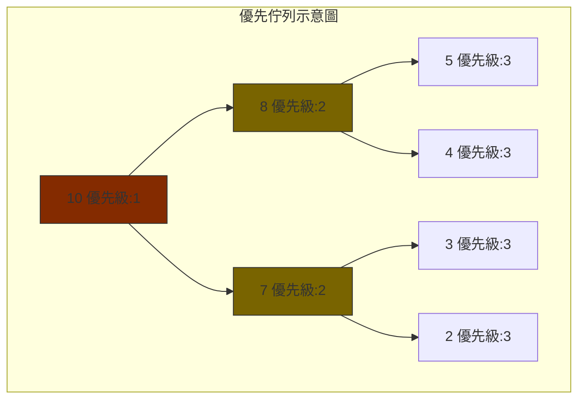
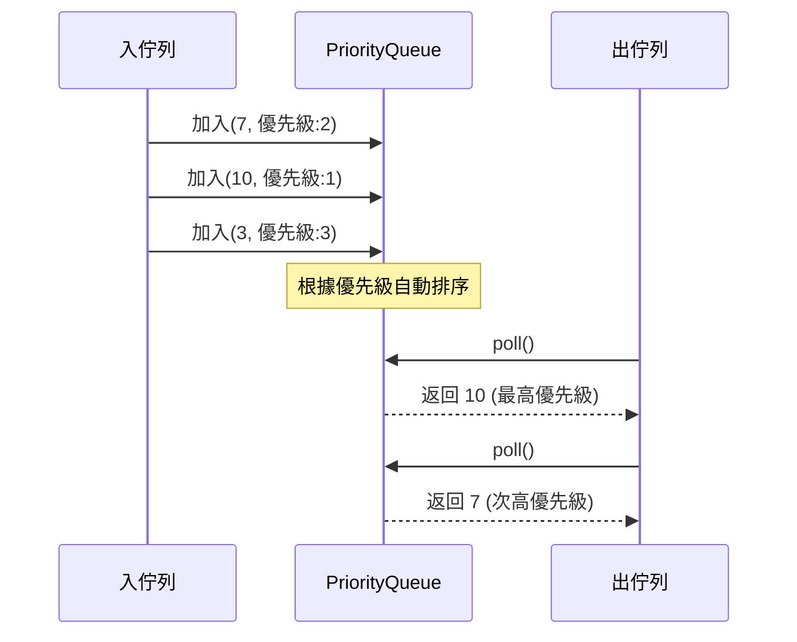
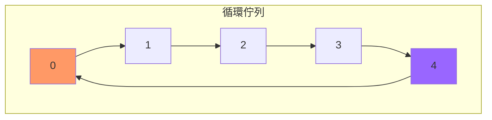
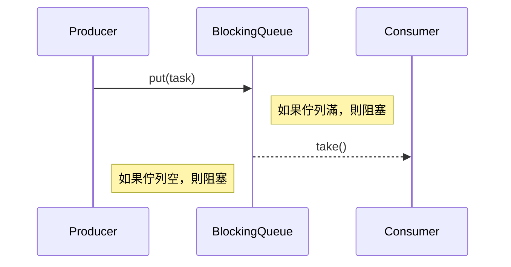
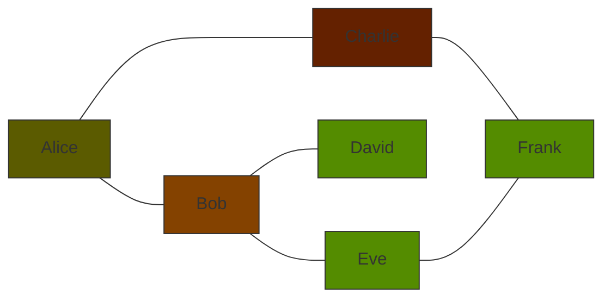

# 用Java學資料結構-佇列Queue

## 基本概念

- Queue 是一種線性的資料結構
- 一定要遵守 FIFO (First In First Out) 原則
- 與 Stack 相反，Stack 是 LIFO (Last In First Out)
- 就好像是排隊的概念，先來的先服務

### Queue定義與特性

- 元素只能在佇列的一端插入，稱為隊尾(rear/tail) -> 後面來的人只能排在後面
- 元素只能在佇列的另一端刪除，稱為隊首(front/head) -> 先來的人，可以先被服務
- 隊列的操作方式是先進先出(FIFO)



### 應用場景實例

- 當我們的應用場景必須遵守先進先出的規則時，就可以使用 Queue 來實現。
    - 銀行排隊系統
    - 印表機列印任務
    - 網路請求的處理
- 或是有需要做緩衝區的地方，也可以使用 Queue 來實現。
    - 生產者消費者模式
    - 影片串流緩衝區

## Queue類型

### 普通佇列(FIFO Queue)

- 普通佇列是最基本的佇列，遵守先進先出的原則。


### 雙端佇列(Deque)

- 雙端佇列是一種可以從兩端進行操作的佇列，可以從隊首或隊尾進行插入和刪除操作。        
- 他結合了 Stack 和 Queue 的特性，可以實現 LIFO 和 FIFO 兩種操作。



### 優先佇列(Priority Queue)

- 每個元素都有一個優先級
- 高優先級的元素先出隊
- 內部實現方式通常是堆(heap)
- 預設會使用最小堆，也可以使用最大堆
- 例如在排工作任務時，就可以使用優先佇列，先處理優先級高的任務。




### 循環佇列(Circular Queue)

- 是環狀結構、固定大小的佇列
- 頭尾相接，形成一個環
- 這樣可以充分利用空間，避免浪費
- 使用頭和尾來來判斷元素的位置



### 阻塞佇列(BlockingQueue)

- 可以支援多執行緒的佇列
- 當佇列是空的時候，從佇列中取元素的操作會被阻塞
- 當佇列是滿的時候，往佇列中加入元素的操作會被阻塞
- 這樣可以避免多執行緒的競爭問題



## 用 Java 實做基本操作與實作 

- 先來建立基礎物件
```java
public class SimpleQueue {
    private int[] elements;
    private int front; // 隊首
    private int rear; // 隊尾
    private int size; // 元素個數
    
    public SimpleQueue(int capacity) {
        elements = new int[capacity];
        front = 0;
        rear = -1; // 隊尾指向-1
        size = 0;
    }
}
```


### 新增元素(enqueue/offer)

```java
    // 新增元素
    public void enqueue(int element) {
        if (size == elements.length) {
            throw new IllegalStateException("Queue is full");
        }
        rear = (rear + 1) % elements.length;
        elements[rear] = element;
        size++;
    }
```

### 移除元素(dequeue/poll)

```java
    // 移除元素
    public int dequeue() {
        if (size == 0) {
            throw new IllegalStateException("Queue is empty");
        }
        int element = elements[front];
        front = (front + 1) % elements.length;
        size--;
        return element;
    }
```

### 查看隊首(peek)

```java
    // 查看隊首元素
    public int peek() {
        if (size == 0) {
            throw new IllegalStateException("Queue is empty");
        }
        return elements[front];
    }
```

### 查看佇列大小(size)

```java
    // 查看佇列大小
    public int size() {
        return size;
    }
```

### 檢查是否為空(isEmpty)

```java
    // 檢查是否為空
    public boolean isEmpty() {
        return size == 0;
    }
```

### 測試程式

```java
public class SimpleQueueTest {
    public static void main(String[] args) {
        SimpleQueue queue = new SimpleQueue(5);
        queue.enqueue(1);
        queue.enqueue(2);
        queue.enqueue(3);
        queue.enqueue(4);
        queue.enqueue(5);
        
//        Queue 是FIFO，所以先進先出
        System.out.println(queue.dequeue()); // 1
        System.out.println(queue.dequeue()); // 2
//        已經移除了1,2，所以現在的隊首是3
        System.out.println(queue.peek()); // 3
//        現在的佇列大小是3
        System.out.println(queue.size()); // 3
        System.out.println(queue.isEmpty()); // false
    }
}
```

### 操作時間複雜度

- 新增元素(enqueue/offer)：O(1)
- 移除元素(dequeue/poll)：O(1)
- 查看隊首(peek)：O(1)
- 查看佇列大小(size)：O(1)
- 檢查是否為空(isEmpty)：O(1)

## 進階應用 (擴展知識)

### 生產者消費者模式

- 生產者消費者模式是一種經典的多執行緒設計模式
- 主要就是分為 生產者(Producer) 和 消費者(Consumer) 兩個角色
- 生產者
    - 負責生產任務，加入佇列
- 消費者
    - 負責消費任務，從佇列中取出任務
- 這樣可以有效的解耦生產者和消費者，提高系統的穩定性和可擴展性
- 簡單的生產者消費者模式範例
    ```java
    public class ProducerConsumer {
        private BlockingQueue<Integer> queue = new ArrayBlockingQueue<>(10);
        
        public void producer() {
            while (true) {
                try {
                    queue.put(1);
                } catch (InterruptedException e) {
                    e.printStackTrace();
                }
            }
        }
        
        public void consumer() {
            while (true) {
                try {
                    queue.take();
                } catch (InterruptedException e) {
                    e.printStackTrace();
                }
            }
        }
    }
    ```

### BFS演算法實現

- BFS (Breadth First Search) 是一種廣度優先搜索演算法
- 是一種圖形與樹的搜索演算法，常用於圖形的最短路徑問題
- 核心概念是 **逐層擴展**，先擴展所有的鄰居節點，再擴展鄰居的鄰居節點
- 而 Queue 是 BFS 演算法的重要工具，用來存儲待擴展的節點
- BFS 的基本概念
    - 廣度優先，從起點開始，先訪問當前節點的所有鄰居節點，再逐層深入，直到所有可達的節點都被訪問過
    - FIFO 特性，BFS是先進先出的，也跟 Queue 的特性一樣


- 如果我想要寫一個推薦好友的功能，我們可以使用 BFS 演算法，這樣推薦的好友清單就會優先推薦與你關係最近的好友。
```java
public class SocialNetworkRecommendation {
    static class User {
        String id;
        String name;

        User(String id, String name) {
            this.id = id;
            this.name = name;
        }

        @Override
        public String toString() {
            return name;
        }
    }

    private Map<String, User> users;
    private Map<User, List<User>> network;

    public SocialNetworkRecommendation() {
        users = new HashMap<>();
        network = new HashMap<>();
        initializeUsers();
        initializeNetwork();
    }

    private void initializeUsers() {
        addUser("1", "Alice");
        addUser("2", "Bob");
        addUser("3", "Charlie");
        addUser("4", "David");
        addUser("5", "Eve");
        addUser("6", "Frank");
    }

    private void addUser(String id, String name) {
        User user = new User(id, name);
        users.put(name.toLowerCase(), user);
    }

    private void initializeNetwork() {
        User alice = users.get("alice");
        User bob = users.get("bob");
        User charlie = users.get("charlie");
        User david = users.get("david");
        User eve = users.get("eve");
        User frank = users.get("frank");

        network.put(alice, Arrays.asList(bob, charlie));
        network.put(bob, Arrays.asList(alice, david, eve));
        network.put(charlie, Arrays.asList(alice, frank));
        network.put(david, Arrays.asList(bob));
        network.put(eve, Arrays.asList(bob, frank));
        network.put(frank, Arrays.asList(charlie, eve));
    }

    public void recommendFriendsForUser(String userName) {
        User user = users.get(userName.toLowerCase());
        if (user == null) {
            System.out.println("找不到用戶: " + userName);
            return;
        }

//        建立一個佇列，用來存放待處理的用戶
        Queue<User> queue = new LinkedList<>();
//        建立一個Map，用來存放每個用戶與起始用戶的距離
        Map<User, Integer> distance = new HashMap<>();
//        建立一個Set，用來存放已經處理過的用戶
        Set<User> visited = new HashSet<>();
//        建立一個List，用來存放推薦的用戶
        List<User> recommendations = new ArrayList<>();

//        先將起始用戶加入佇列、設定距離為0，並標記為已處理
        queue.offer(user);
        distance.put(user, 0);
        visited.add(user);

        System.out.println("\n為 " + user + " 尋找好友推薦：");

//        當佇列不為空時，持續處理
        while (!queue.isEmpty()) {
//            取出佇列中的用戶
            User current = queue.poll();
//            取得該用戶與起始用戶的距離
            int currentDistance = distance.get(current);

//            遍歷 好友網路中的所有用戶
            for (User friend : network.getOrDefault(current, Collections.emptyList())) {
//                如果該用戶尚未處理過
                if (!visited.contains(friend)) {
//                    將該用戶加入佇列，待會要遍歷這個用戶的好友
                    queue.offer(friend);
//                    把這個好友標注為已處理
                    visited.add(friend);
//                    設定這個好友與起始用戶的距離
                    distance.put(friend, currentDistance + 1);

                    // 只推薦非直接好友的用戶(即距離大於1的用戶)
                    if (currentDistance + 1 > 1) {
                        recommendations.add(friend);
                    }
                }
            }
        }

        if (recommendations.isEmpty()) {
            System.out.println("沒有可推薦的好友");
        } else {
            System.out.println("好友推薦清單（不包含已是好友的用戶）：");
            for (int i = 0; i < recommendations.size(); i++) {
                User recommended = recommendations.get(i);
                System.out.printf("第%d優先順位 - %s (距離: %d度關係)%n",
                        i + 1, recommended, distance.get(recommended));
            }
        }
    }

    public static void main(String[] args) {
        SocialNetworkRecommendation system = new SocialNetworkRecommendation();
        Scanner scanner = new Scanner(System.in);

        while (true) {
            System.out.print("\n請輸入要查詢的用戶名稱 (輸入exit退出): ");
            String input = scanner.nextLine().trim();

            if (input.equalsIgnoreCase("exit")) {
                break;
            }

            system.recommendFriendsForUser(input);
        }

        scanner.close();
    }
}
```

- 稍微解釋一下這個程式
    - 首先我們建立了一個用戶類 User，用來表示用戶的基本信息
    - 然後我們建立了一個 SocialNetworkRecommendation 類，用來表示社交網路推薦系統
    - 在這個類中，我們建立了用戶列表 users 和好友網路 network
    - 用戶列表 users 用來存放所有用戶的信息，好友網路 network 用來存放用戶之間的好友關係
    - 在 initializeUsers 方法中，我們初始化了用戶列表
    - 在 initializeNetwork 方法中，我們初始化了好友網路
    - 在 recommendFriendsForUser 方法
        - Queue 用來存放待處理的用戶，有 FIFO 的特性
        - LinkedList 適合用來實現 Queue，頻繁的插入和刪除操作
        - Map 用來存放每個用戶與起始用戶的距離
        - Set 用來存放已經處理過的用戶，因為不需要重複的值，並且查找速度快
        - List 用來存放推薦的用戶，且要保持順序
    - 在 recommendFriendsForUser 方法中，我們使用 BFS 演算法來尋找好友推薦
        - 首先將起始用戶加入佇列、設定距離為0，並標記為已處理
        - 當佇列不為空時，持續處理
        - 取出佇列中的用戶，取得該用戶與起始用戶的距離
        - 遍歷好友網路中的所有用戶
        - 如果該用戶尚未處理過，將該用戶加入佇列，待會要遍歷這個用戶的好友
        - 把這個好友標注為已處理，設定這個好友與起始用戶的距離
        - 只推薦非直接好友的用戶(即距離大於1的用戶)

### 任務排程系統

- 我們來做一個任務排程系統
- 排序的規則
    1. 任務的優先級越高，越先執行
    2. 如果優先級相同，則按照任務的到達時間先後執行
- 我們會使用 `PriorityQueue` 來實現這個系統
- `PriorityQueue` 的特性
    - 是基於堆(heap)的一種優先佇列
    - 預設是最小堆，也可以自定義排序規則
    - 優先級高的元素先出隊
    - 內部實現是一個完全二叉樹
```java
public class TaskSchedulingSystem {
    static class Task implements Comparable<Task> {
        private String name;
        private int priority;  // 1-5, 1最高優先
        private int executionTime;  // seconds
        private long submissionTime;

        public Task(String name, int priority, int executionTime) {
            this.name = name;
            this.priority = priority;
            this.executionTime = executionTime;
            this.submissionTime = System.currentTimeMillis();
        }

// 我們會使用 PriorityQueue 來封裝這個 Task
// 當我們使用了 PriorityQueue 的 offer() 方法時，會自動調用這個 compareTo() 方法
// 預攝氏最小堆，以數值小的或字串字典排序為優先
// 我們可以透過 @Override 來自定義排序規則
// 在這邊我們就優先排序優先級，再排序提交時間
        @Override
        public int compareTo(Task other) {
            // 優先比較優先級，再比較提交時間
            if (this.priority != other.priority) {
                return Integer.compare(this.priority, other.priority);
            }
            return Long.compare(this.submissionTime, other.submissionTime);
        }

        @Override
        public String toString() {
            return String.format("Task[%s, 優先級=%d, 執行時間=%ds]",
                    name, priority, executionTime);
        }
    }

    static class TaskScheduler {
        private PriorityQueue<Task> taskQueue;

        public TaskScheduler() {
            taskQueue = new PriorityQueue<>();
        }

        public void addTask(Task task) {
            taskQueue.offer(task);
            System.out.println("新增任務: " + task);
        }

        public void executeTasks() {
            System.out.println("\n開始執行任務...");
            int totalTasks = taskQueue.size();
            int completedTasks = 0;

            while (!taskQueue.isEmpty()) {
                Task currentTask = taskQueue.poll();
                completedTasks++;

                System.out.printf("\n執行任務 (%d/%d): %s\n",
                        completedTasks, totalTasks, currentTask);

                // 模擬任務執行
                try {
                    Thread.sleep(currentTask.executionTime * 1000); // 縮短等待時間
                    System.out.println("任務完成！");
                } catch (InterruptedException e) {
                    Thread.currentThread().interrupt();
                }
            }

            System.out.println("\n所有任務已完成！");
        }
    }

    public static void main(String[] args) {
        TaskScheduler scheduler = new TaskScheduler();

        // 新增測試任務
        scheduler.addTask(new Task("備份資料庫", 1, 5));
        scheduler.addTask(new Task("更新快取", 2, 2));
        scheduler.addTask(new Task("發送電子報", 3, 3));
        scheduler.addTask(new Task("日誌清理", 2, 1));
        scheduler.addTask(new Task("系統掃描", 1, 4));

        // 執行任務佇列
        scheduler.executeTasks();
    }
}
```

### 銀行排隊系統

- 再來我們來做一個銀行排隊系統
- 銀行排隊系統的規則
    - 可指定有多少個服務櫃檯
    - 客戶到達時，會取號，VIP客戶優先
    - 每個服務櫃檯只能服務一個客戶
    - 模擬服務時間，每個客戶服務時間為1秒
- 我們會使用 `PriorityQueue` 來實現這個系統

```java
public class BankQueueSystem {
    // 客戶類別
    static class Customer implements Comparable<Customer> {
        private String number;      // 號碼牌
        private boolean isVip;      // VIP身份
        private long arrivalTime;   // 到達時間

        public Customer(String number, boolean isVip) {
            this.number = number;
            this.isVip = isVip;
            this.arrivalTime = System.currentTimeMillis();
        }

        @Override
        public int compareTo(Customer other) {
            // VIP優先，同級別按到達時間排序
            if (this.isVip != other.isVip) {
                return this.isVip ? -1 : 1;
            }
            return Long.compare(this.arrivalTime, other.arrivalTime);
        }

        @Override
        public String toString() {
            return String.format("號碼:%s %s", number, isVip ? "(VIP)" : "");
        }
    }

    static class BankCounter {
        private String name;
        private Customer currentCustomer;

        public BankCounter(String name) {
            this.name = name;
        }

        public void serveCustomer(Customer customer) {
            this.currentCustomer = customer;
            System.out.printf("%s開始服務 %s\n", name, customer);
        }

        public void finishService() {
            System.out.printf("%s完成服務 %s\n", name, currentCustomer);
            this.currentCustomer = null;
        }

        public boolean isAvailable() {
            return currentCustomer == null;
        }
    }

    private PriorityQueue<Customer> waitingQueue;
    private List<BankCounter> counters;
    private int normalNumber = 1;
    private int vipNumber = 1;

    public BankQueueSystem(int counterCount) {
        this.waitingQueue = new PriorityQueue<>();
        this.counters = new ArrayList<>();
        for (int i = 0; i < counterCount; i++) {
            counters.add(new BankCounter("櫃檯" + (i + 1)));
        }
    }

    public void addCustomer(boolean isVip) {
        String number;
        if (isVip) {
            number = String.format("V%03d", vipNumber++);
        } else {
            number = String.format("N%03d", normalNumber++);
        }

        Customer customer = new Customer(number, isVip);
        waitingQueue.offer(customer);
        System.out.printf("新客戶取號: %s\n", customer);
    }

    public void processQueue() {
        System.out.println("\n開始處理排隊...");

        while (!waitingQueue.isEmpty()) {
            // 尋找可用櫃檯
            for (BankCounter counter : counters) {
                if (counter.isAvailable() && !waitingQueue.isEmpty()) {
                    Customer customer = waitingQueue.poll();
                    counter.serveCustomer(customer);

                    // 模擬服務時間
                    try {
                        Thread.sleep(1000);
                        counter.finishService();
                    } catch (InterruptedException e) {
                        Thread.currentThread().interrupt();
                    }
                }
            }
        }

        System.out.println("所有客戶已處理完畢！");
    }

    public static void main(String[] args) {
        BankQueueSystem bank = new BankQueueSystem(3);  // 3個服務櫃檯

        // 模擬客戶到達
        bank.addCustomer(false); // 一般客戶
        bank.addCustomer(true);  // VIP客戶
        bank.addCustomer(false); // 一般客戶
        bank.addCustomer(true);  // VIP客戶
        bank.addCustomer(false); // 一般客戶

        // 處理排隊
        bank.processQueue();
    }
}
```
